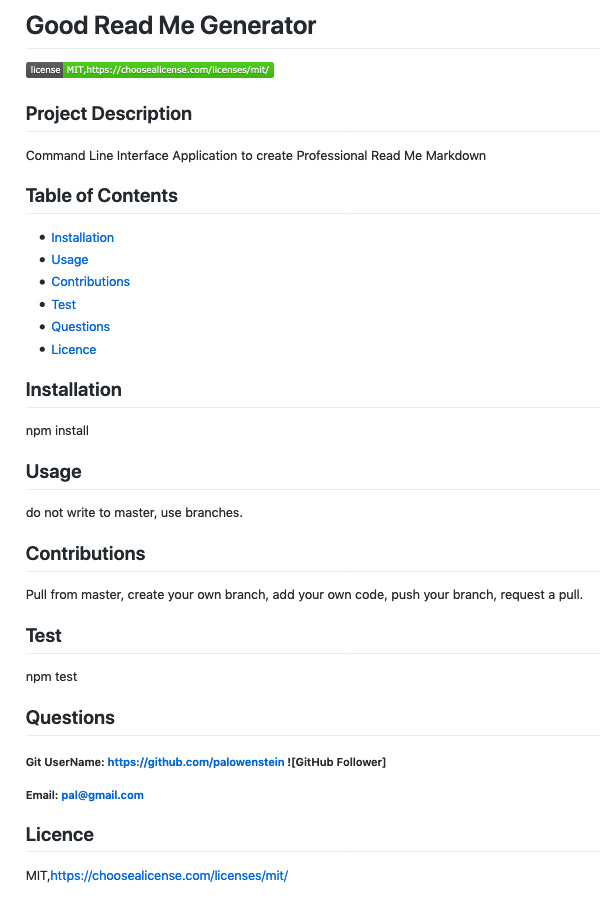

## #hw9-cli-good-readme-generator

<h3>READ ME Generator executed via Command Line Interface (CLI) in Terminal.</h3>

Github Repository Page: https://github.com/palowenstein/hw9-cli-good-readme-generator

Github Deployment Page: N/A - App is to be executed in Terminal via CLI.

# Table of Contents
  * [GIF](#Gif)
  * [Overview](#Overview)
  * [Details](#Details)
  * [Instructions](#Instructions)
  * [Screenshots](#Screenshots)
  * [Video](#Video)
  * [References](#References)
  * [License](#License)
  * [Contact](#Contact)

## GIF
")

## Overview
<ul>
<li>Read Me Generator executed in Terminal via (CLI) Command Line Interface.</li>
<li>Application behaves accordingly to standard ("good") practices and dynamically generates a professional README markdown file.</li>
<li>User is prompted to respond to each question, one at a time.</li>
<li>All questions are answered via a character string except for the licence, which is choice driven.</li>
<li>The goal of the application is its simplicity of use and its overall time saving for the final user.</li>
</ul>

## Details
<ul>
<li>A .gitignore file is present at the root level to prevent the upload of node_modules, .DS_Store.</li>
<li>The included package.json file includes all dependencies if the user wants to run 'npm install' instead of the instructions below</li>
</ul>

## Instructions
<ul>
<li>In Terminal, locate the application folder and enter into it via the 'cd' command: cd hw9-cli-good-readme-generator</li>
<li>Run the 'npm init' command to fill the package json with the application information (screenshot #1).
<li>Run the 'npm inquirer' to install the inquirer dependencies.</li>
<li>Run the 'node index.js' command to start the application in Terminal.</li>
<li>While still in Terminal, answer the following prompts (screenshot #2):
    <ol>
    <li>Title</li>
    <li>Description</li>
    <li>Table of Contents</li>
    <li>Installation</li>
    <li>Usage</li>
    <li>License (Choice only question)</li>
    <li>Contributing</li>
    <li>Tests</li>
    <li>Questions</li>
    </ol>
<li>Once all questions have been answered, a "README — Title (based on the title entered).md" will be generated in the application folder</li>
</ul>

<i>Refer to index.js (javascript file) for code dissection.</i>

## Screenshots

")
")

## Video
")

## References
<ul>
<li>Node.js</li>
<li>Javascript</li>
<li>Inquirer</li>
<li>ES6+</li>
<li>Axios (optional - for GitHub username verification)</li>
</ul>

 ## License

<a href="./MITlicense.txt">MIT License</a> | Copyright © [2020] Pierre André Lowenstein

 ## Contact

<a href="http://pierreandrelowenstein.com" title="[www] Pierre Andr&eacute; Lowenstein" target="_blank">[www] pierreandrelowenstein.com</a>
&nbsp;|&nbsp;
<a href="mailto:soundtrackspecialist@gmail.com" title="Courriel">Send me a 'courriel'</a>

